# 🤓 Coding/Tech Expertise Interview Preparation FAQ

## 1. 🛠️ Software Engineering Best Practices

**Q1: What are the key principles of software engineering best practices that you follow?**

**A1:** The key principles include:

- **Modular Design**: Separation of concerns to keep code components independent.
- **Code Reusability**: Writing code that can be used in multiple contexts.
- **Simplicity (KISS 🧠)**: Keeping the implementation as straightforward as possible.
- **Avoiding Premature Optimization**: Focus on simplicity first, and optimize later when needed.
- **Continuous Integration and Delivery (CI/CD 🚀)**: Ensuring code changes are regularly tested and integrated.
- **Unit Testing 🧪**: Writing tests to verify each part of the software functions as expected.
- **High Code Quality**: Achieved through **refactoring 🔄** and **code reviews 👀**.

Additionally, focusing on clean, maintainable code and collaborating effectively with stakeholders are crucial to ensuring the project aligns with business needs. Regular communication with team members and stakeholders helps ensure everyone is on the same page, reducing misunderstandings and helping the project progress smoothly. Incorporating agile methodologies, such as iterative development and regular sprint reviews, also plays a vital role in maintaining efficiency and quality throughout the project lifecycle.

**Q2: How do you ensure scalability and reliability when building software?**

**A2:** Scalability and reliability are ensured by designing with scalability in mind, such as using microservices architecture 🏗️, load balancing ⚖️, and horizontal scaling 📈. Additionally, implementing redundancy 🔄, automated monitoring 📊, and graceful error handling mechanisms helps improve reliability. Regular stress testing 💪 and performance monitoring also help in identifying bottlenecks. It's important to leverage caching mechanisms to improve response times, as well as implement autoscaling to adjust to dynamic loads automatically. Another key factor is the use of disaster recovery planning and implementing rollback strategies, which helps in minimizing downtime during failures and ensuring business continuity.

**Q3: Can you explain the importance of automated testing in the software development lifecycle?**

**A3:** Automated testing ensures software stability, reduces human errors, and accelerates the development lifecycle by providing quick feedback to developers. It allows for continuous integration and delivery, ensures faster detection of bugs 🐞, and ultimately saves time ⏳ and costs 💰 by avoiding regressions. Automated tests include unit tests, integration tests, end-to-end tests, and UI tests, each serving different purposes in validating the functionality of the software. Additionally, incorporating test-driven development (TDD) can lead to better code design, as it encourages developers to think through requirements before writing the actual implementation.

**Q4: How do you handle technical debt in a project?**

**A4:** Technical debt 💸 is managed by balancing immediate needs and long-term maintainability. Identifying and prioritizing areas that need improvement, allocating time ⏱️ in the development cycle for refactoring 🔄, and incorporating best practices to avoid accumulating more debt are crucial. Continuous refactoring and reviewing the codebase regularly help mitigate its impact. Communication with stakeholders about the impact of technical debt and ensuring they understand its consequences is important to secure time and resources to address it. Automating code quality checks, such as using static analysis tools, can also help identify technical debt early on and prevent it from growing.

## 2. 💻 Coding Best Practices

**Q1: What are some common coding best practices you follow when developing software?**

**A1:** Common coding best practices include:

- **Consistent Code Style ✨**: Ensures uniformity across the codebase.
- **Clear and Self-Documenting Code 📜**: Write code that explains itself.
- **Meaningful Variable and Function Names 🏷️**: Use descriptive names to improve readability.
- **Avoiding Magic Numbers 🔢**: Replace literal values with named constants.
- **Effective Error Handling 🚫**: Implement proper mechanisms for error detection and recovery.
- **Modular Functions 🧩**: Break down functionality into smaller, reusable functions.
- **SOLID Principles**: Adhere to these principles for better code maintainability.
- **Effective Version Control**: Create feature branches, write descriptive commit messages, and conduct thorough code reviews.
- **Documentation**: Maintain documentation for both the code and API to help future developers understand and contribute to the project.

**Q2: How do you approach writing clean code?**

**A2:** Clean code is achieved by maintaining simplicity 🧠, avoiding redundancy, and making sure the code is readable 👓. Comments should explain "why" something is done rather than "how." Following coding standards, ensuring each function has a single responsibility, and breaking down complex tasks into smaller functions contribute to code cleanliness. Additionally, removing dead code, avoiding overly clever solutions, and naming things consistently and descriptively help in keeping the codebase easy to navigate and maintain. Clean code also involves writing tests, which ensures that future changes don't break existing functionality and keeps the code reliable.

**Q3: How do you ensure that code is maintainable and extensible?**

**A3:** Writing modular and loosely coupled code ensures maintainability. Following design patterns 🏗️ where applicable, using proper abstractions, writing tests 🧪, and keeping the documentation up to date 📖 contribute to easier code maintenance. Extensibility is achieved by designing for change, using interfaces, and following the open-closed principle. Moreover, anticipating potential changes and using dependency injection where applicable helps to reduce coupling and make the codebase easier to modify or extend. It's also useful to apply SOLID principles and ensure the code is easy to refactor without affecting other parts of the system.

## 3. ☁️ Modern Tech Stack (Cloud, Microservices, Container-Based Systems)

**Q1: How do you use cloud services in software development?**

**A1:** Cloud services, such as AWS ☁️, are used for:

```mermaid
graph TD;
    A[AWS ☁️ Cloud Services] --> B[Hosting Applications 🏠];
    A --> C[Providing Databases: RDS 🗄️];
    A --> D[Load Balancing ⚖️];
    A --> E[Scaling Infrastructure Dynamically 📈];
    A --> F[Serverless Computing: AWS Lambda ⚡];
    A --> G[Managed Services for Monitoring, Logging, Security 📊 📝 🔒];
    A --> H[Infrastructure as Code Tools, e.g., AWS CloudFormation, Terraform];
    A --> I[Cloud-Based CI/CD Pipelines]
```



- **Hosting Applications 🏠**: Running websites, services, and APIs.
- **Providing Databases (RDS 🗄️)**: Managed databases that are easy to set up and scale.
- **Load Balancing ⚖️**: Distributing traffic to ensure reliability and performance.
- **Scaling Infrastructure Dynamically 📈**: Adjusting resources based on demand.
- **Serverless Computing (e.g., AWS Lambda ⚡)**: Deploying microservices without managing servers.
- **Managed Services for Monitoring 📊, Logging 📝, and Security 🔒**: Reducing operational overhead.
- **Infrastructure as Code (IaC) Tools (e.g., AWS CloudFormation, Terraform)**: Automating and ensuring consistent provisioning of cloud resources.
- **Cloud-Based CI/CD Pipelines**: Automating deployment processes for faster and more reliable releases.

**Q2: What are the advantages of using microservices architecture?**

**A2:** Microservices provide several benefits, including:

- **Flexibility 🤸**: Allow independent development and deployment of services.
- **Independent Scalability 📈**: Each service can be scaled independently.
- **Fault Isolation 🚧**: Enables isolation of faults, reducing the impact of failures.
- **Improved Maintainability 🎯**: The codebase for each service is smaller and more focused, making it easier to maintain.
- **Technology Stack Freedom**: Teams can choose the best tools for each specific problem, as different services can use different technology stacks.

However, microservices require proper handling of service communication, such as:
- **Service Communication Management**: Using message queues or API gateways to effectively manage inter-service communication.

**Q3: How are container-based systems used in modern software development?**

**A3:** Containers 🐳, such as those managed with Docker, allow consistent development environments, ensuring code runs the same regardless of the host. Kubernetes ☸️ is commonly used to orchestrate these containers, handle scaling 📈, and manage container lifecycles. Containers promote portability 🌍 and simplify dependency management. Containers are also useful for creating isolated environments for testing and deployment, which makes continuous delivery more efficient. By using tools like Helm for Kubernetes, deployment of complex applications can be templated and managed in a consistent manner, facilitating both development and production environments.

**Q4: What challenges might arise when working with cloud-native applications?**

**A4:** Challenges include managing distributed systems 🧩, monitoring multiple microservices 📊, security configurations 🔒, controlling cloud costs 💰, and maintaining communication between services. Networking complexity, data consistency 📊, and efficient logging are also significant challenges in cloud-native environments. Implementing effective monitoring and observability is crucial to understand the health of cloud-native applications. Tools like Prometheus and Grafana for metrics, and ELK stack for logging, are often used to gain insights into system performance and detect issues early. Managing state and data consistency across distributed systems can be complex, often requiring strategies like eventual consistency and using distributed databases.

## 4. 🐍 Programming Languages (Kotlin and Python)

**Q1: What are the primary advantages of using Kotlin compared to other JVM languages?**

**A1:** Kotlin offers better type safety 🛡️, null safety 🚫, and concise syntax ✍️ compared to Java. It supports functional programming paradigms, provides extension functions ➕, and has powerful features like data classes and coroutines, which make concurrency simpler ⚙️. Kotlin’s interoperability with Java also makes it ideal for transitioning existing projects. Kotlin's expressive syntax reduces boilerplate code, which improves productivity and reduces the likelihood of errors. Its compatibility with popular build tools like Gradle and Maven also makes integrating it into existing Java projects easier, offering a smooth transition for teams.

**Q2: How do you handle concurrency in Python?**

**A2:** Concurrency in Python 🐍 can be managed using threads 🧵, multiprocessing, and asynchronous programming (asyncio 🔄). The Global Interpreter Lock (GIL) can make true multi-threading challenging, so the multiprocessing module or async programming is often preferred for CPU-bound and I/O-bound tasks, respectively. Asyncio provides a great way to write non-blocking code, particularly for I/O-bound tasks like network communication. For CPU-bound tasks, multiprocessing is preferred to bypass the limitations of GIL and leverage multiple CPU cores. Libraries such as Celery are also useful for handling distributed task queues when building scalable applications.

**Q3: Can you give an example of when you would choose Kotlin over Python and vice versa?**

**A3:** Kotlin would be chosen for Android app development 📱 or when working with an existing JVM ecosystem, especially where performance is a priority 🏎️. Python would be selected for data analysis 📊, machine learning 🤖 tasks, or rapid prototyping 🚀 because of its extensive library support and ease of use. Kotlin is a great choice for building enterprise-grade backend systems that require static typing, which helps catch errors at compile time. On the other hand, Python’s rich ecosystem of data science libraries such as Pandas, NumPy, and TensorFlow makes it the preferred choice for AI and data analytics projects.

## 5. 📦 Modern Fulfillment System and Simulation System

**Q1: How would you develop a simulation model for a logistics network?**

**A1:** Developing a logistics simulation involves understanding key elements like warehouses 🏢, transportation 🚚, and order processing 📦. Discrete event simulation can be used to model each action within the network, considering factors like lead times ⏳, inventory levels 📊, and constraints. Tools like SimPy or custom Python code can be used to build these models. It is also important to gather historical data to parameterize the model and ensure it accurately reflects real-world processes. Incorporating stochastic elements, such as variability in processing times, helps to create a more realistic representation of logistics operations, allowing for more robust decision-making.

**Q2: What challenges might arise in simulating fulfillment systems?**

**A2:** Challenges include accurately modeling complex interactions, handling large data volumes 📚, ensuring the simulation matches real-world variability 🌍, and integrating real-time data ⏱️ to validate the model. Calibration and validation against historical data are crucial to ensure the reliability of simulations. Additionally, managing computational complexity is a challenge, as detailed simulations can be resource-intensive. Techniques like parallelization or using cloud-based resources can help mitigate this. Another challenge is aligning the model with changing business requirements, which requires flexibility and frequent updates to keep the simulation relevant.

**Q3: How do simulation and experimentation contribute to fulfillment system optimization?**

**A3:** Simulations allow testing different strategies in a controlled environment without impacting real operations 🔬. They help in resource allocation, optimizing inventory placement 📦, and analyzing the impact of demand surges 📈. Experimentation, such as A/B testing or switchback testing, can validate hypotheses on order allocation strategies, providing data-driven insights for optimization 📊. Simulations also allow businesses to evaluate "what-if" scenarios, such as the impact of opening new warehouses or changing transportation routes, thereby aiding strategic planning. Using a combination of simulation and real-world experiments ensures that models are accurate and the insights derived are actionable and effective.

**Q4: How do you measure the effectiveness of a fulfillment strategy?**

**A4:** Effectiveness can be measured by key performance indicators 📊 such as delivery time ⏱️, order accuracy ✅, cost efficiency 💰, and customer satisfaction 😊. Simulations provide insight into how different variables affect these KPIs. Metrics like throughput, resource utilization ⚙️, and lead time ⏳ also help assess fulfillment strategies. Customer feedback and Net Promoter Score (NPS) are useful indicators of overall satisfaction. Analyzing trends in returns and reasons for returns also provides valuable insights into fulfillment effectiveness. Continuously monitoring these metrics allows for iterative improvements to be made, optimizing both operational efficiency and customer experience.

## Annex: Live Coding Questions and Answers

**Q1: Implement a Function to Find Duplicates in an Array**

**A1:** You could write a function that uses a set to track seen numbers and another set to track duplicates. For example:

```python
# Python implementation
def find_duplicates(arr):
    seen = set()
    duplicates = set()
    for num in arr:
        if num in seen:
            duplicates.add(num)
        else:
            seen.add(num)
    return list(duplicates)
```

**Q2: Implement a Sorting Algorithm**

**A2:** You could be asked to implement a common sorting algorithm such as Merge Sort:

```python
# Python implementation of Merge Sort
def merge_sort(arr):
    if len(arr) > 1:
        mid = len(arr) // 2
        left_half = arr[:mid]
        right_half = arr[mid:]

        merge_sort(left_half)
        merge_sort(right_half)

        i = j = k = 0

        while i < len(left_half) and j < len(right_half):
            if left_half[i] < right_half[j]:
                arr[k] = left_half[i]
                i += 1
            else:
                arr[k] = right_half[j]
                j += 1
            k += 1

        while i < len(left_half):
            arr[k] = left_half[i]
            i += 1
            k += 1

        while j < len(right_half):
            arr[k] = right_half[j]
            j += 1
            k += 1
```

**Q3: Fibonacci Sequence**

**A3:** Implement a function to return the `n`th Fibonacci number, both iteratively and recursively:

```python
# Iterative implementation
def fibonacci_iterative(n):
    a, b = 0, 1
    for _ in range(n):
        a, b = b, a + b
    return a

# Recursive implementation
def fibonacci_recursive(n):
    if n <= 1:
        return n
    return fibonacci_recursive(n-1) + fibonacci_recursive(n-2)
```

**Q4: String Reversal with Conditions**

**A4:** Write a function that reverses a given string but only reverses the alphabetic characters:

```python
# Python implementation
def reverse_only_letters(s):
    letters = [c for c in s if c.isalpha()]
    result = []
    for c in s:
        if c.isalpha():
            result.append(letters.pop())
        else:
            result.append(c)
    return ''.join(result)
```

**Q5: Implement a Stack or Queue**

**A5:** You could implement a basic stack using a list:

```python
# Python implementation of a Stack
class Stack:
    def __init__(self):
        self.items = []

    def push(self, item):
        self.items.append(item)

    def pop(self):
        if not self.is_empty():
            return self.items.pop()
        return None

    def is_empty(self):
        return len(self.items) == 0
```

**Q6: Binary Search Tree (BST) Operations**

**A6:** Write code to insert and search in a BST:

```python
# Python implementation of BST Node
class Node:
    def __init__(self, key):
        self.left = None
        self.right = None
        self.val = key

# Function to insert a new node
def insert(root, key):
    if root is None:
        return Node(key)
    else:
        if root.val < key:
            root.right = insert(root.right, key)
        else:
            root.left = insert(root.left, key)
    return root

# Function to search a node
def search(root, key):
    if root is None or root.val == key:
        return root
    if root.val < key:
        return search(root.right, key)
    return search(root.left, key)
```

**Q7: Find the Depth of a Binary Tree**

**A7:** Write a function that calculates the depth of a given binary tree:

```python
# Python implementation
def max_depth(node):
    if node is None:
        return 0
    else:
        left_depth = max_depth(node.left)
        right_depth = max_depth(node.right)
        return max(left_depth, right_depth) + 1
```

**Q8: Design a Simple Vending Machine**

**A8:** Design the basic functionality of a vending machine using OOP concepts:

```python
# Python implementation
class VendingMachine:
    def __init__(self):
        self.inventory = {'soda': 10, 'chips': 5, 'chocolate': 2}
        self.balance = 0

    def insert_coin(self, amount):
        self.balance += amount

    def select_item(self, item):
        if item in self.inventory and self.inventory[item] > 0:
            if self.balance >= 1:  # Assume each item costs 1 unit
                self.inventory[item] -= 1
                self.balance -= 1
                return f'{item} dispensed'
            else:
                return 'Insufficient balance'
        else:
            return 'Item out of stock'
```

**Q9: Parking Lot System**

**A9:** Design a parking lot system where different vehicle types take up different amounts of space:

```python
# Python implementation
class ParkingLot:
    def __init__(self, small, medium, large):
        self.spots = {'small': small, 'medium': medium, 'large': large}

    def park_vehicle(self, vehicle_type):
        if self.spots[vehicle_type] > 0:
            self.spots[vehicle_type] -= 1
            return f'{vehicle_type} vehicle parked'
        else:
            return 'No available spots'
```

**Q10: API Request Simulation**

**A10:** Simulate multiple API requests and handle responses with retries:

```python
# Python implementation
import time
import random

def api_request():
    if random.choice([True, False]):
        return 'Success'
    else:
        raise Exception('Request failed')

def make_requests_with_retries(retries):
    for _ in range(retries):
        try:
            response = api_request()
            return response
        except Exception as e:
            print(e)
            time.sleep(1)
    return 'Failed after retries'
```
